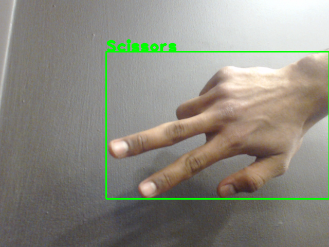

<!-- body{ font-family: "Times New Roman", Times, serif; } p{ font-family: "Times New Roman", Times, serif; margin: 10px 10px 15px 20px; } h3{ margin: 5px; } h2{ margin: 10px; } h1{ margin: 10px 0px 0px 20px; } div.main-body{ align:center; margin: 30px; } hr{ margin:20px 0px 20px 0px; } -->

  

Hand Gestures Recognition System Using Python And Open-cv

============================================================

Authors:  
Abdulshaheed Alqunber  
Faisal Mushayt  
Aprild 3rd, 2019

* * *

Problem Definition
------------------

In this project we were asked to implement and design a smart system that can recognize different hand shapes and gestures, static and dynamic ones from a live webcam using different open-cv library in python. The problem specifically requires us to use some of the following computer vision techniques:

1.  [how to access video camera input with OpenCV](https://opencv-python-tutroals.readthedocs.io/en/latest/py_tutorials/py_gui/py_video_display/py_video_display.html)
2.  background differencing: D(x,y,t) = |I(x,y,t)-I(x,y,0)|
3.  frame-to-frame differencing: D’(x,y,t) = |I(x,y,t)-I(x,y,t-1)|
4.  template matching (e.g., create templates of a closed hand and an open hand)
5.  motion energy templates (union of binary difference images over a window of time)
6.  skin-color detection (e.g., thresholding red and green pixel values)
7.  horizontal and vertical projections to find bounding boxes of ”movement blobs” or ”skin-color blobs”
8.  size, position, and orientation of ”movement blobs” or ”skin-color blobs”
9.  circularity of ”movement blobs” or ”skin-color blobs”
10.  tracking the position and orientation of moving objects

Using any combination of techniques mentioned above, we would be able to recognize 3 static hand gestures from the famous game Rock Paper Scissors, as well as dynamic gesture, wave. In the end, this problem will let us explore, learn and solve one of real world problems in the computer vision divsion.

#### our overall goals of this project:

1.  Learn the basics of image processing
2.  Learn the basics functions in open-cv and how to read from a cam
3.  Implement a system that recognize different hand signs
4.  Understand

* * *

Method and Implementation
-------------------------

From the begining we anticipated difficulties with differentiating background from foreground in different places and different lightings settings and similarly shaped figures from the object we were trying to classify.

#### 1st Attempt: Template Matching

Our first attempt to solve this problem was to use template matching method. We modified a function we obtained from OpenCV's tutorial on the subject and called it myTemplateMatching(). The function takes a source image (img) and compares it to a template image (tmplt). We had two template images: tmplt-open, tmplt-rock. The program starts by reading the camera feed and convert the frame to gray scale image and then apply template matching. Surprisingly, it worked from the first run; however, it was not doing very well with my teammates hands as it strictly has to match my hands. We tried to combine other methods but that did not work very well. Because of these inconsistencies, we decided to switch our approach to another method.

#### 2nd Attempt: Background Differencing

In second attempt to solve this problem we used the background subtractor methods available in cv2. There were couple different methods we decided to give it a shot and try all of them. BackgroundSubtractorMOG2 was the best among all of them. That being said, the frame produced was too blurry and obscure for us to do any kind of object matching. So, we eventually gave up on this as well.

#### 3rd Attempt: Convex Hulls

After quite a bit of research, we realized creating a moving ROI was pretty difficult. Furthermore, any kind of results we got were extremely innacurate. So, we decided to place contours on a mask frame and find a convex hull and its defects. So, we preprocessed the image by first converting it from BGR to HSV to match a skin color template and create the mask. Then we erode the mask, dilate it, and create a gaussian blur which we can then find the contours on. We then fit a convex hull on the contours, draw the hull and its defects on the processed mask, use it to create a rectangle around the object in the original frame, and classify it based on the number of convexity defects.

**additional methods outside the main file were implemented as a helper in for testing:***   mySkinDetect(src)
*   myFrameDifferencing(hull, curr\_frame)
*   myMotionEnergy(mh)

* * *

Experiments
-----------

For testing we did 20 different tests for each gesture to evaluate our system. For each test, we attempted to keep ourselves and other background items out of view so as not to skew our results or create erroneous classifications. We evaluated the results of our experiments by examining the output label of each gesture in the test and then campe up with a confusion matrix, the number of correct classifications versus incorrect ones. We repeated the same testing process for static open-hand and dynamic wave. We also tested to make sure that the program will only classify open-handed as a wave.

* * *

Results
-------

The following are the results from our final system evaluation, we calculated the accuracy, precision, recall and F1 score. The model is solid on darker backgrounds and good lighting settings.

### Count confusion matrix

### Percentage confusion matrix

### Accuracies, precisions, recalls and F1 scores for all classes

**Paper class:***   Accuracy: 80%
*   Precision: 0.52
*   Recall: 0.8
*   F1 score: 0.63

**Scissors class:***   Accuracy: 50%
*   Precision: 0.33
*   Recall: 0.5
*   F1 score: 0.4

**Rock class:***   Accuracy: 45%
*   Precision: 0.53
*   Recall: 0.45
*   F1 score: 0.49

**Waiving class:***   Accuracy: 100%
*   Precision: 1
*   Recall: 1
*   F1 score: 1

**Not Recognized class:***   Accuracy: 10%
*   Precision: 1
*   Recall: 0.1
*   F1 score: 0.18

### Paper class testing

  

### Rock class testing

  

### Scissors class testing

  

### Waving class testing

 

* * *

Discussion
----------

#### *   Strength and Weakness of our method:

##### Strength:

Our implementation showed pretty good results for all static and dynamic gestures. Because we are not using template matching the system can detect both hands left or right and back or front in any trained gesture.

##### Weakness:

Our system will not work well in low light settings or very bright settings. This is because sometimes the shadows will be considered in our find\_contour functions which will results in false classification.

#### *   Expectation:

We expected the template matching would work on all cases without any issues but we were wrong. It was very strict on its matching algorithm. Background differencing was very probalmatic as well thus we moved to convex hulls as our final method.

#### *   Potential future work:

We would love to include more static and dynamic gestures to to be recognized in our system. We also would like to add the ability to make the gestures to control the mouse of the computer or a robotic arm. This would be an interesting project to work on.

* * *

Conclusions
-----------

We like our current implementation duo to its quick run-time which makes it a relatively inexpensive operation to perform on the images. Unlike other methods like mySkinDetect which is very expensive to compute (n2) where we can see the frames are being very slow in display. We had awesome ideas to implement alongside detection hand gestures If we had more time to work on this project to include them. This assignment caught our attention in this interesting field and we are very excited about the future of computer vision techniques in this area. We would love to see some great applications in American Sign Language. More advanced programs could potentially string together sentences and phrases signed in ASL, for use in either speech-to-type or similar technologies.

* * *

Credits and Bibliography
------------------------

*   [https://pythonprogramming.net/template-matching-python-opencv-tutorial/](https://pythonprogramming.net/template-matching-python-opencv-tutorial/) accessed on April 1st, 2019
*   [https://docs.opencv.org/3.3.0/db/d5c/tutorial\_py\_bg\_subtraction.html](https://docs.opencv.org/3.3.0/db/d5c/tutorial_py_bg_subtraction.html) accessed on April 1st, 2019

* * *
